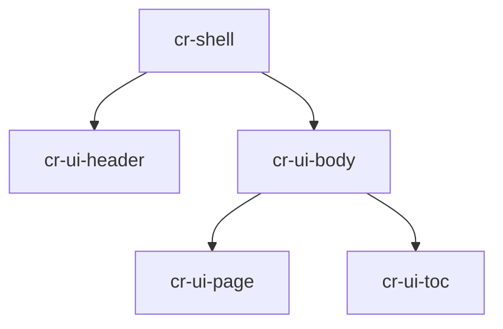

# Reader architecture

The reader is a small custom-element tree [KNOWN]: a shell owns the hash route and pushes `sitemap` + `route` down to the sidebar and the main column. Rendering happens client-side [INFERRED] to stay buildless — marked parses, DOMPurify sanitizes, highlight.js and mermaid progressively enhance.



```js
// fenced code, syntax-highlighted
const route = location.hash.replace(/^#\/?/, "");
```
