# Advanced Mermaid — Authoring Reference

The catalog **corpus-reader** (`tools/corpus-reader/`, vendored into brand-forge + product-forge) renders Mermaid client-side via **`mermaid@11.15.0`**, loaded as an SRI-pinned classic script and initialized with **`securityLevel: "strict"`**. This reference covers the **advanced diagram types** beyond the everyday `flowchart` / `sequenceDiagram` / `classDiagram` / `stateDiagram-v2` — what they are, the exact (often `-beta`-suffixed) keyword, whether they render in our pinned build, and the verbatim minimal syntax.

The companion **[mermaid-rubric.md](mermaid-rubric.md)** scores a diagram for *fit · validity · renderability · legibility · accessibility · portability* — use it when creating or reviewing a diagram.

> Syntax here is copied verbatim from the canonical OSS docs (mermaid.js.org) and the `mermaid-js/mermaid` source, cross-checked against mermaid.ai. Where mermaid.ai documents a feature ahead of the OSS release, this doc follows **what actually parses in 11.15.0** and says so.

---

## §1 — The reader-compatibility contract (READ FIRST)

These six constraints are load-bearing. A diagram that violates one renders wrong, or not at all, in the catalog reader — even if it works in the Mermaid Live Editor.

1. **The engine is `mermaid@11.15.0`.** A diagram type or feature added in a *later* release will not render. To check the pin: `grep mermaid@ tools/corpus-reader/index.html`. Bumping it is a deliberate, SRI-recomputing change (see the reader CHANGELOG).
2. **`securityLevel` is `"strict"` — there is no interactivity.** `click` bindings, `call`-back handlers, and clickable hyperlinks are **disabled**, and **HTML tags inside labels are HTML-encoded** (so `<br/>`, `<b>`, `<a>` in a label render as literal text, not markup). Never author a diagram whose meaning depends on a click or on HTML in a label.
3. **No icon packs are registered.** `architecture-beta` can only use the **five built-in icons** (`cloud`, `database`, `disk`, `internet`, `server`). Iconify packs (`logos:aws-lambda`, …) require a host-side `mermaid.registerIconPacks(...)` call, which a Markdown fence cannot make — so they silently fail in the reader.
4. **The theme is reader-controlled** (light/dark by OS preference). A per-diagram `%%{init: {"theme": …}}%%` *can* override it but fights the reader's own `initialize()`; prefer leaving theme to the reader and only setting structural config.
5. **The `-beta` suffix is part of the keyword.** Many advanced types (`sankey-beta`, `architecture-beta`, `venn-beta`, …) are a hard **syntax error** without their exact suffix. The mermaid.ai docs sometimes show the un-suffixed aspirational form (notably `sankey`) — that does **not** parse in 11.15.0.
6. **Host-side JS config does not travel in a fence.** The `sankey` / `kanban` / `architecture` JavaScript config objects shown in some docs are set on the *host* (`mermaid.initialize`). Inside a corpus Markdown fence only **in-diagram config** works: YAML frontmatter `config:`, the `%%{init}%%` directive, or inline `style`.

---

## §2 — Keyword & version matrix

Every requested advanced type **is present in open-source `mermaid@11.15.0`** — none is MermaidChart-proprietary. The columns that bite are **Keyword** (exact, incl. `-beta`) and **Needs interactivity** (which our strict reader denies).

| Diagram | Exact keyword | Introduced | `-beta`? | Renders in reader (11.15.0, strict)? | Notes |
| --- | --- | --- | :---: | :---: | --- |
| User Journey | `journey` | core (8.x) | no | ✅ | satisfaction-scored task flow |
| Gantt | `gantt` | core (early) | no | ✅ (static) | `click` links need `loose` → **disabled** here |
| Entity Relationship | `erDiagram` | core (8.x) | no | ✅ | crow's-foot cardinality |
| Sankey | `sankey-beta` | v10.3.0+ | **yes** | ✅ | **bare `sankey` is a syntax error** (mermaid.ai docs are wrong) |
| Kanban | `kanban` | v11.4.0 | no | ✅ | `ticketBaseUrl` link is host-config |
| Architecture | `architecture-beta` | v11.1.0 | **yes** | ✅ (built-in icons only) | iconify packs need host registration |
| Tree View | `treeView-beta` | v11.14.0 | **yes** | ✅ | indentation-structured |
| Venn | `venn-beta` | v11.13.0 | **yes** | ✅ | set overlap |
| Ishikawa (fishbone) | `ishikawa-beta` | v11.13.0 | **yes** | ✅ | no `fishbone` keyword |
| Wardley Map | `wardley-beta` | v11.14.0 | **yes** | ✅ | coords are `[visibility, evolution]` |
| Event Modeling | `eventmodeling` | v11.15.0 | no | ✅ (minimal renderer) | newest; parser ahead of renderer |

Also stable core (not detailed here): `flowchart`/`graph`, `sequenceDiagram`, `classDiagram`, `stateDiagram-v2`, `pie`, `quadrantChart`, `requirementDiagram`, `gitGraph`, `mindmap`, `timeline`, `xyChart`, `block`, `packet`, `radar`, `c4`, `zenuml`, `treemap`.

---

## §3 — Fundamentals

**Declaring a diagram.** A diagram is a fenced block whose info-string is `mermaid`; the **first non-blank line is the diagram-type keyword**:

````markdown

````

**Config: frontmatter (preferred) vs the `%%{init}%%` directive.** Both set inline configuration; the directive form is **deprecated since v10.5.0** but still parses. Prefer YAML frontmatter:

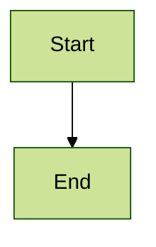

The directive equivalent (still works): `%%{init: { "theme": "forest" } }%%` on its own line before the body.

**Themes** (set via config, not per-diagram unless you must): `default` · `neutral` (B/W print) · `dark` · `forest` (greens) · `base` (the only customizable one — needs hex colors in `themeVariables`). In the reader the theme is chosen by OS light/dark; override sparingly.

**`securityLevel`** (the reader fixes this to `strict`): `strict` (default — HTML in labels encoded, clicks off) · `antiscript` (HTML allowed except `<script>`, clicks on) · `loose` (HTML + clicks on) · `sandbox` (renders in a sandboxed iframe). Interactivity requires `loose`/`antiscript` — **unavailable in the reader by design.**

**Accessibility.** Every diagram type accepts `accTitle:` and `accDescr:` lines — set them; they become the SVG's accessible title/description. Color must never be the *only* channel carrying meaning.

---

## §4 — The advanced diagram types

Each entry: purpose · exact keyword + version · a **verbatim** minimal example · key constructs · reader-specific gotchas.

### User Journey (`journey`)

High-level map of the steps a user takes to complete a task, each scored 1–5 for satisfaction. Core type, no `-beta`.

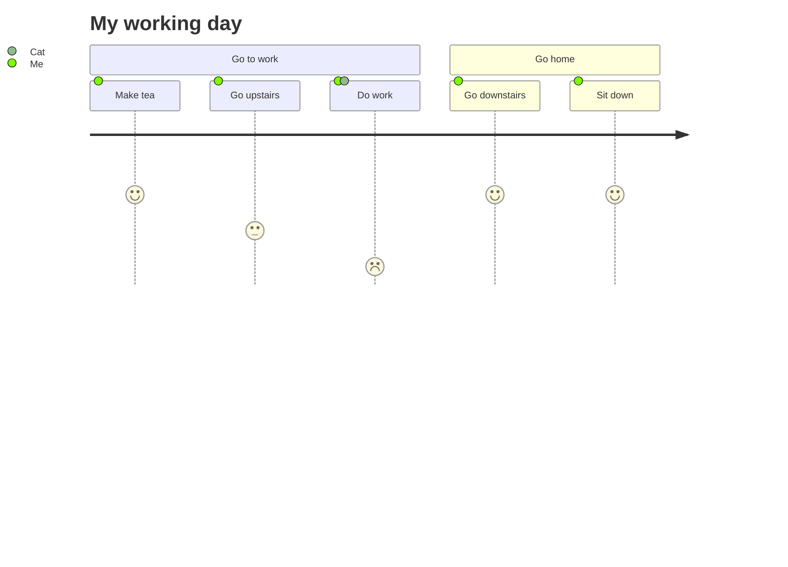

- **Title:** `title …` · **Section:** `section …` · **Task:** `Name: <score 1-5>: <comma-separated actors>` — note the **two colons**.
- Each distinct actor gets its own colored legend marker — keep names consistent (`Me` ≠ `me`).
- **Gotchas:** score must be an integer 1–5; omitting the score or actors breaks the line; one task per line.

### Gantt (`gantt`)

Project schedule — tasks over time, with durations, dependencies, and milestones. Core type.

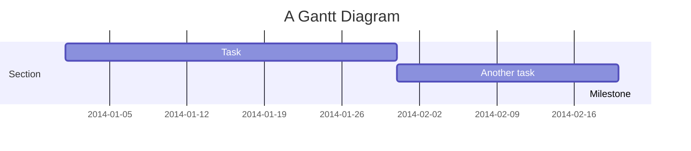

- **Input/axis dates:** `dateFormat YYYY-MM-DD` (parse) vs `axisFormat %Y-%m-%d` (display) — keep distinct.
- **Task:** `Name :[status,] id, start, duration|end` — status tags (`active`/`done`/`crit`/`milestone`) come **first**. Durations: `30d`/`2w`/`1.5d` (units `ms,s,m,h,d,w,M,y`). Dependencies: `after id`, `until id`.
- **Reader gotcha:** `click taskId href …` needs `securityLevel: loose` → **disabled in the reader**; the chart still renders, the links just don't fire. `excludes weekends` extends a task spanning them.

### Entity Relationship (`erDiagram`)

Data-domain entities and their cardinality relationships (schemas, domain models). Core type.

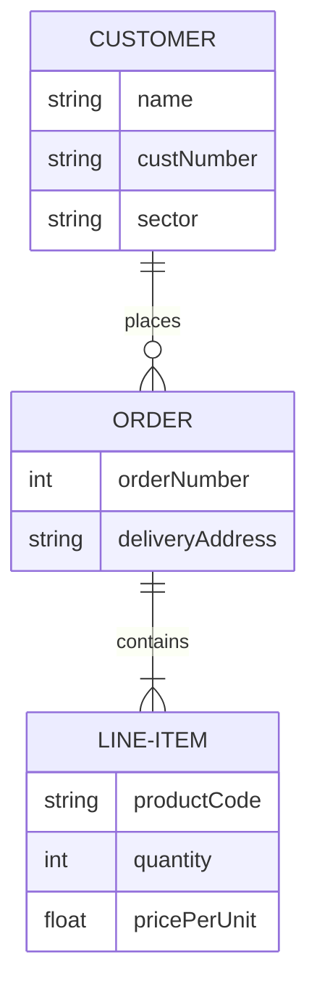

- **Relationship:** `ENTITY <card>--<card> ENTITY : label`. Cardinality halves combine across the line: `|o` zero-or-one · `||` exactly-one · `}o`/`o{` zero-or-more · `}|`/`|{` one-or-more (e.g. `||--o{`). `--` identifying (solid), `..` non-identifying (dashed).
- **Attributes:** `ENTITY { type name [PK|FK|UK] ["comment"] }` — **type first**; keys limited to `PK`/`FK`/`UK`; comments double-quoted.
- **Gotchas:** spaces in an entity name need the alias form `ENTITY ["Two Words"] { … }`; a malformed cardinality pair (a stray single `|`) fails the strict parser.

### Sankey (`sankey-beta`)

Proportional-width flows between nodes (energy, budgets, funnels). **The suffix is mandatory.**

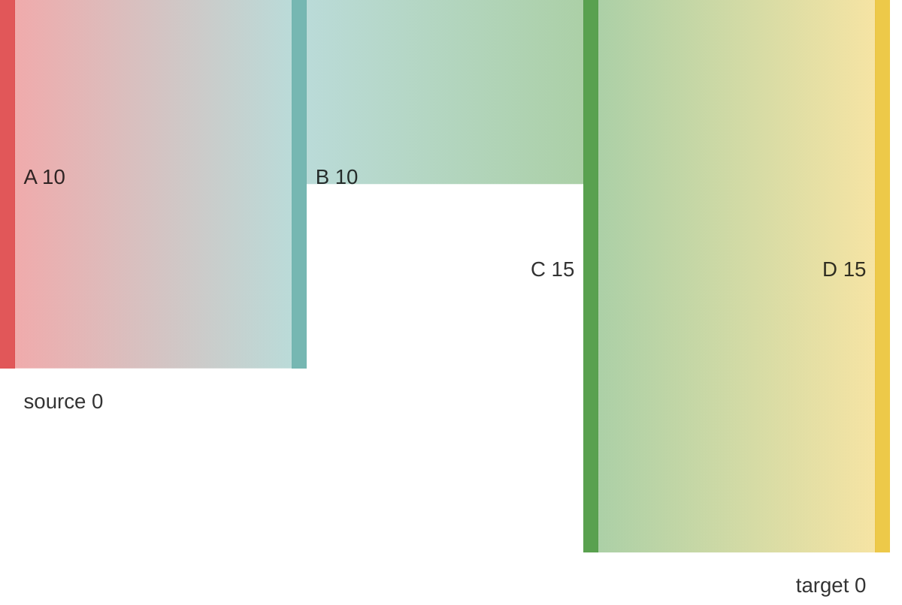

- **Body is strict CSV:** exactly **three columns** `source,target,value`, one flow per row. Empty lines allowed for spacing. A literal comma in a field needs double-quoting (`"a, b",target,5`); a literal quote is doubled (`""`).
- **⚠️ The single biggest gotcha:** bare **`sankey` throws `Syntax error in text`** in OSS 11.15.0 (mermaid-js/mermaid #7613) — the mermaid.ai page that shows `sankey` is ahead of the release. **Always write `sankey-beta`.**
- **Reader gotcha:** `width`/`height`/`linkColor`/`nodeAlignment`/`nodeWidth`/`labelStyle` are **host config** (don't travel in a fence). The diagram renders with defaults in the reader.

### Kanban (`kanban`)

Work items flowing through workflow columns, with optional assignees/tickets/priority. No `-beta`.

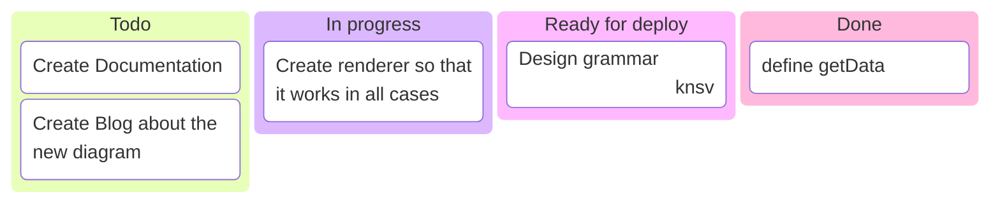

- **Column:** `id[Title]` (or bare `[Title]`) at base indent. **Card:** `id[Text]` **indented** under its column. **Metadata:** append `@{ assigned: '…', ticket: MC-2038, priority: 'High' }` immediately after the `]` (no space).
- **Priority** is a closed set: `'Very High'` · `'High'` · `'Low'` · `'Very Low'` (quote them).
- **Reader gotcha:** `ticketBaseUrl` (which turns `ticket:` into a link) is **host frontmatter config** — set it in the diagram's `config:` block; without it tickets are plain text. Indentation is structural — wrong indent reassigns a card's column.

### Architecture (`architecture-beta`)

Services/resources in a cloud or CI/CD deployment, grouped into boundaries. **Suffix mandatory.**

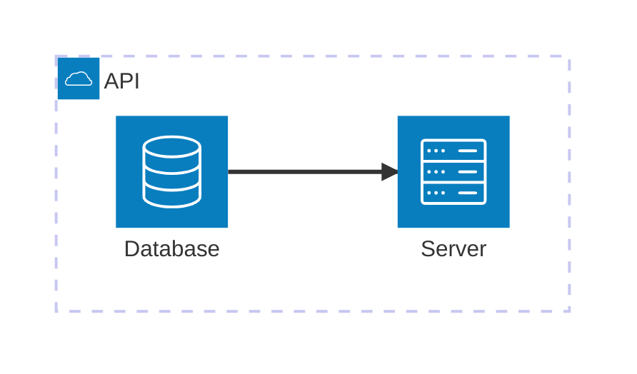

- **Group:** `group id(icon)[Title] [in parent]` · **Service:** `service id(icon)[Title] [in parent]` · **Edge with ports:** `svc:R --> L:svc2` (ports `T`/`B`/`L`/`R`). **Junction** (4-way): `junction id`.
- **Reader gotcha (critical):** only the **five built-in icons** (`cloud`, `database`, `disk`, `internet`, `server`) work — iconify packs need a host `registerIconPacks()` the reader doesn't run, so they fail. Stick to the built-ins for portable corpus diagrams. Layout is force-directed (non-deterministic) unless you set `%%{init: {"architecture": {"randomize": true}}}%%` or the 11.15.0 fcose knobs.

### Tree View (`treeView-beta`)

Hierarchical/directory-like data with file-type icons and connectors. **Suffix mandatory** (added v11.14.0).

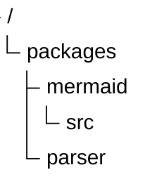

- **Structure is indentation-only.** Labels bare or `"quoted"` (for spaces); a trailing `/` marks a directory; files auto-detect by extension. Box-drawing input (`├──`, `└──`, `│`) is also accepted.
- **Gotchas:** the literal `treeView-beta` keyword is required; inconsistent indentation silently reshapes the tree. Richer annotations (`:::class`, `## description`, `icon(...)`) post-date the 11.14.0 base — the quoted-label form above is the safest for 11.15.0.

### Venn (`venn-beta`)

Set membership and overlap. **Suffix mandatory** (v11.13.0). Beta — syntax may evolve.

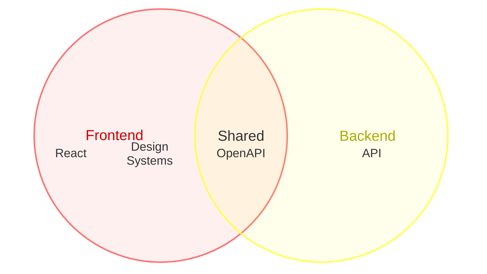

- **Set:** `set Id["Label"]` · **Overlap:** `union A,B["Label"]` (comma-separated, ids must be **defined by earlier `set` lines**) · **Member:** indented `text Id["…"]` attaches to the most recent set/union · **Size:** `:N` suffix · **Style:** `style Id fill:…`.
- **Gotchas:** forward references in a `union` fail; indentation/order is load-bearing; plain `venn` won't parse.

### Ishikawa / Fishbone (`ishikawa-beta`)

Cause-and-effect (root-cause) analysis — the problem at the head, categorized causes off the spine. **Suffix mandatory** (v11.13.0). There is **no `fishbone` keyword.**

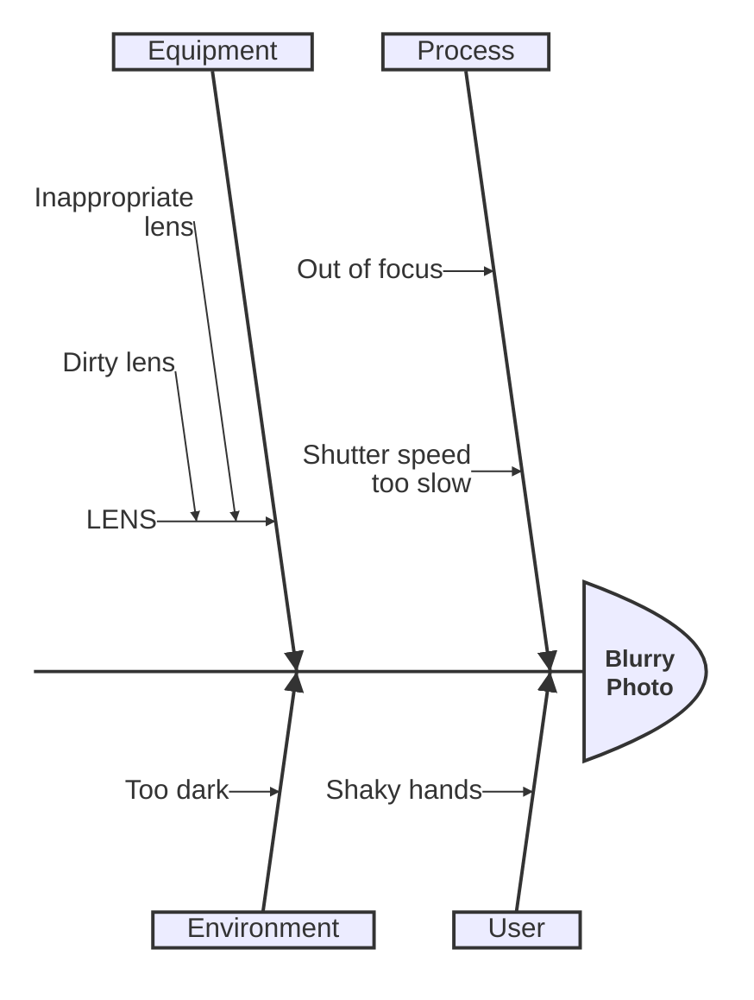

- **First content line is the problem/effect** (the fish head). Every later line is a cause; **indentation depth = hierarchy** (category → cause → sub-cause). No arrow operators — structure is purely indentation.
- **Gotchas:** the literal `ishikawa-beta` keyword; consistent 4-space steps; don't indent the effect line like a cause.

### Wardley Map (`wardley-beta`)

Strategic value-chain map: components plotted by visibility × evolution. **Suffix mandatory** (v11.14.0).

```mermaid
wardley-beta
title Tea Shop Value Chain
anchor Business [0.95, 0.63]
component Cup of Tea [0.79, 0.61]
Business -> Cup of Tea
```

- **Coordinates are `[visibility, evolution]` — i.e. `[Y, X]`, the reverse of intuitive (x,y).** Getting it backwards mirrors the map.
- **Component:** `component Name [v, e]` · **Anchor (user):** `anchor Name [v, e]` · **Dependency:** `A -> B` · **Flow:** `A +> B` · **Evolve:** `evolve Name target` · decorators `(inertia)`, `(build|buy|outsource|market)`.
- **Gotchas:** `-beta` mandatory; `look: handDrawn` unsupported. On 11.15.0 specifically, hyphens in unquoted component names are allowed (a 11.15.0 fix) — on 11.14.0 they are not.

### Event Modeling (`eventmodeling`)

Event-sourced systems as a timeline across fixed swimlanes (UI / command / event / read-model / processor). **No `-beta` suffix.** Newest type — **introduced in 11.15.0 itself**, with a deliberately minimal renderer.

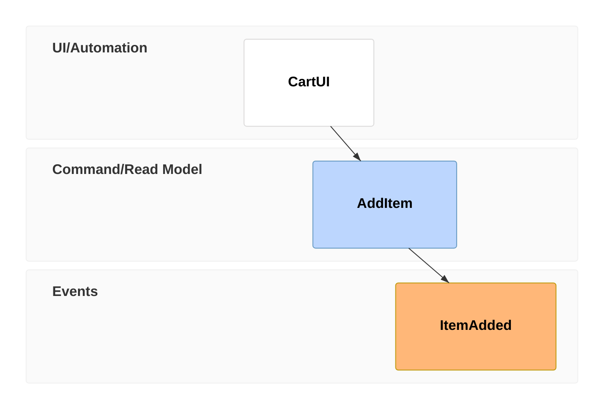

- **Time frame:** `tf <n> <type> <Entity>` (alias `timeframe`). **Types:** `ui` · `cmd`/`command` · `evt`/`event` · `rmo`/`readmodel` · `pcr`/`processor`. **Inline data:** `tf 01 ui CartUI { "items": 5 }`. **Explicit relation:** `tf 05 rmo RM ->> Event1` (otherwise inferred).
- **Gotchas:** **no `-beta`** here (unlike Venn/Ishikawa). The renderer is early — the grammar parses more than it draws, so complex diagrams render sparsely even when valid. Keep frame numbers sequential.

---

## §5 — Cross-cutting authoring gotchas (v11 strict parser)

These bite across diagram types, especially under the reader's `securityLevel: "strict"`:

1. **One statement per line.** Avoid trailing semicolons; the v11 parser is stricter than older versions about statement separation.
2. **HTML in labels is inert under strict.** `<br/>`, `<b>`, `<a href>` inside a node/message label are HTML-encoded and shown literally. For multi-line labels, prefer the diagram's own newline mechanism (e.g. `\n` where supported) rather than `<br/>`.
3. **Quote labels with special characters.** Parentheses, colons, `#`, `{`/`}`, commas, and `-` in a *bare* label can confuse the parser — wrap the label in `"…"`. (Crow's-foot ERD names, Wardley component names on 11.14.0, etc.)
4. **Use the exact keyword incl. `-beta`.** `sankey` → error (use `sankey-beta`); `architecture`/`venn`/`ishikawa`/`wardley`/`treeView` all need `-beta`; `kanban`/`eventmodeling`/`journey`/`gantt`/`erDiagram` do **not**.
5. **Don't depend on interactivity or host config.** No `click`, no iconify packs, no JS-side `sankey`/`kanban` config — none of it survives a strict, host-config-free Markdown fence.
6. **Sequence-diagram sensitivities (verify in the reader).** One team building on this reader reported that, in their pipeline, sequence constructs `par`/`and`, `opt`, `note right of`, quoted strings / `;` / `=` in message bodies, `<br/>`, and the `rect rgb(…)` wrapper tripped rendering. These are *valid* Mermaid syntax, so the cause was likely strict-mode label encoding or markdown handling rather than the grammar — **but treat them as "render-test before committing."** The `<br/>` and `rect rgb()` cases are explained by strict-mode HTML/label handling (#1–#2 above).

---

## §6 — Verifying a diagram before you commit it

A diagram that doesn't render is worse than prose. Before committing corpus content with a new diagram:

1. **Bake the corpus and open it** — the truest test, since it uses the exact pinned engine + strict config:
   ```bash
   python3 tools/corpus-reader/build-sitemap.py --bake <your-corpus>
   # open <your-corpus>/reader.html and navigate to the page
   ```
2. **Or use the Mermaid Live Editor pinned to v11** (`https://mermaid.live`) with `securityLevel: strict` — but the bake is authoritative for the reader.
3. **Run it past [the rubric](mermaid-rubric.md)** — at minimum the two `[gate]` dimensions (M2 validity/version-safety, M3 renders-in-target).

---

## §7 — Sources

Canonical: [mermaid.js.org/syntax](https://mermaid.js.org/) · the `mermaid-js/mermaid` GitHub source + [releases](https://github.com/mermaid-js/mermaid/releases) (v11.15.0 release notes; #7613 for the sankey-keyword gotcha) · cross-checked against the mermaid.ai `/open-source/` docs. Version attributions verified against the CHANGELOG, not the docs-page headers (which mis-stated Venn/Ishikawa as v11.12.3 — they shipped in v11.13.0).
